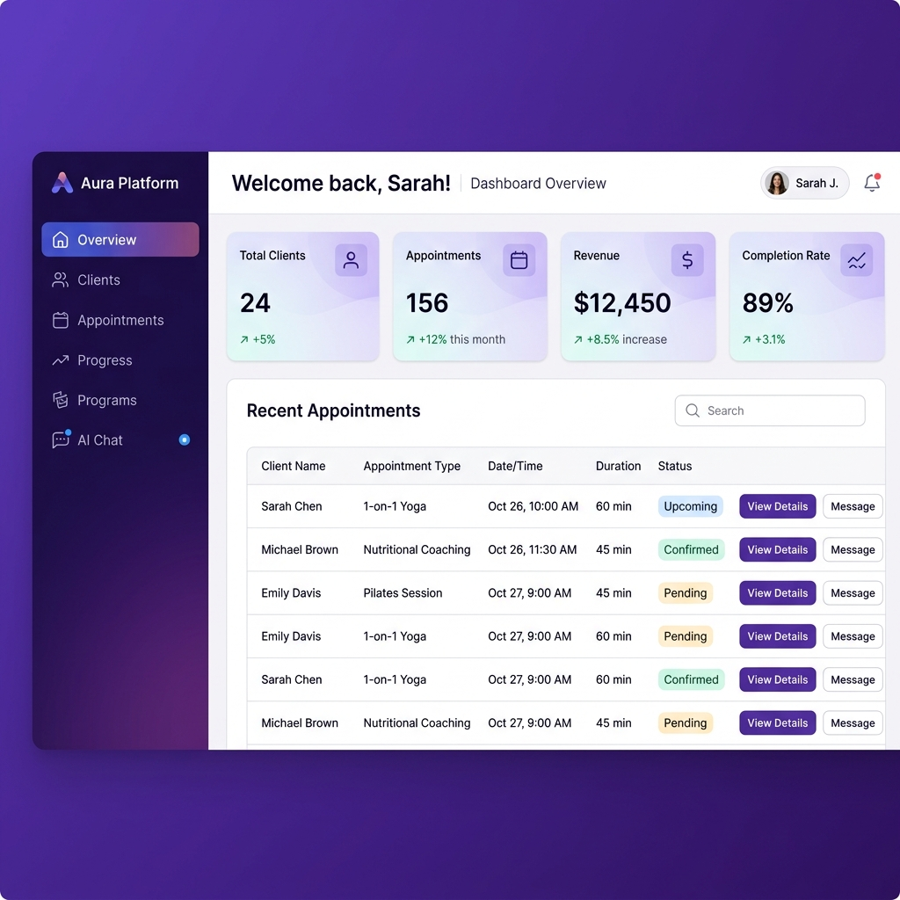

# Aura Platform Demo

## 🎥 Live Demo

[](https://github.com/mbugus94-lang/aura-platform)

### Quick Demo Walkthrough

```bash
# 1. Clone and setup
git clone https://github.com/mbugus94-lang/aura-platform.git
cd aura-platform
npm install

# 2. Configure environment (optional - for AI and email features)
cp .env.example .env
# Edit .env and add your OPENAI_API_KEY and/or email settings

# 3. Start the server
npm start

# 4. Open in browser
open http://localhost:3000
```

### Demo Credentials
- **Email:** demo@aura.com
- **Password:** demo123

---

## ✨ Feature Highlights

### 1. AI-Powered Chat Assistant
- Get instant fitness and nutrition advice
- Personalized recommendations based on client profiles
- Powered by OpenAI GPT (or intelligent fallback)

**Try it:**
1. Login and go to the AI Chat section
2. Ask: "What should I eat before a workout?"
3. Ask: "Create a program for a beginner wanting to lose weight"

### 2. Client Management
- Complete CRM with health profiles
- Track goals, medical history, measurements
- Search and filter clients

### 3. Appointment Scheduling
- Book and manage client sessions
- Automated email reminders (when email configured)
- Calendar view of upcoming appointments

### 4. Progress Tracking
- Log weight, body fat, measurements
- Visualize trends over time
- AI-powered progress analysis

### 5. Program Builder
- Create custom workout programs
- AI-generated programs based on client goals
- Exercise library with instructions

### 6. Invoicing & Payments
- Generate professional invoices
- Track payment status
- Email invoices to clients

**Try it:**
```bash
curl -X POST http://localhost:3000/api/invoices \
  -H "Authorization: Bearer YOUR_TOKEN" \
  -H "Content-Type: application/json" \
  -d '{
    "clientId": 1,
    "amount": 150.00,
    "total": 150.00,
    "dueDate": "2025-03-01"
  }'
```

### 7. Automated Email Scheduling 🆕
- Automatic daily appointment reminders (9:00 AM)
- Weekly business summaries (Mondays 8:00 AM)
- Progress check-ins every 3 days
- Overdue invoice reminders
- All powered by node-cron scheduler

**Scheduler runs automatically when server starts:**
```bash
# Check health endpoint to see scheduler status
curl http://localhost:3000/health
```

**Manual trigger examples:**
```bash
# Send appointment reminder
curl -X POST http://localhost:3000/api/appointments/1/remind \
  -H "Authorization: Bearer YOUR_TOKEN"
```

### 8. Google Calendar Integration 🆕
- Sync appointments to Google Calendar
- Automatic event creation with reminders
- Update and delete events when appointments change
- OAuth2 secure authentication

**Setup:**
```bash
# 1. Configure Google OAuth credentials in .env
GOOGLE_CLIENT_ID=your-client-id.apps.googleusercontent.com
GOOGLE_CLIENT_SECRET=your-client-secret

# 2. Get OAuth URL
curl http://localhost:3000/api/calendar/auth \
  -H "Authorization: Bearer YOUR_TOKEN"

# 3. Visit the authUrl to connect your calendar

# 4. Check connection status
curl http://localhost:3000/api/calendar/status \
  -H "Authorization: Bearer YOUR_TOKEN"
```

**Sync appointments:**
```bash
# Sync single appointment
curl -X POST http://localhost:3000/api/appointments/1/sync-calendar \
  -H "Authorization: Bearer YOUR_TOKEN"

# Sync all upcoming appointments
curl -X POST http://localhost:3000/api/calendar/sync-all \
  -H "Authorization: Bearer YOUR_TOKEN"

# Disconnect calendar
curl -X DELETE http://localhost:3000/api/calendar/disconnect \
  -H "Authorization: Bearer YOUR_TOKEN"
```

### 9. Analytics Dashboard
- Business metrics at a glance
- Client retention rates
- Revenue tracking

---

## 🖼️ Screenshots

### Dashboard

*Overview of your wellness business with key metrics*

### Client Management

*Manage all your clients in one place*

### AI Chat

*Get AI-powered fitness and nutrition guidance*

### Appointments

*Schedule and manage client sessions*

---

## 🚀 API Demo

### Login
```bash
curl -X POST http://localhost:3000/api/auth/login \
  -H "Content-Type: application/json" \
  -d '{"email":"demo@aura.com","password":"demo123"}'
```

### Get Clients
```bash
curl http://localhost:3000/api/clients \
  -H "Authorization: Bearer YOUR_TOKEN"
```

### AI Chat
```bash
curl -X POST http://localhost:3000/api/chat \
  -H "Authorization: Bearer YOUR_TOKEN" \
  -H "Content-Type: application/json" \
  -d '{"message":"What should I eat before a workout?"}'
```

### Generate AI Workout Program
```bash
curl -X POST http://localhost:3000/api/ai/generate-program \
  -H "Authorization: Bearer YOUR_TOKEN" \
  -H "Content-Type: application/json" \
  -d '{
    "fitnessLevel": "beginner",
    "goals": "lose weight and build strength",
    "timePerSession": "45 minutes",
    "frequency": "3 days per week"
  }'
```

---

## 🎯 Use Cases

### For Personal Trainers
- Manage 20+ clients without spreadsheets
- AI assistant answers client questions 24/7
- Track progress automatically
- Send professional invoices

### For Yoga Studios
- Simple scheduling system
- Member management
- Automated appointment reminders
- Focus on teaching, not admin

### For Fitness Startups
- MVP for your business idea
- Extend with your own features
- Deploy anywhere
- AI-powered client engagement

---

## 🔧 Configuration Options

### Enable AI Features
```env
OPENAI_API_KEY=sk-your-openai-api-key-here
```

### Enable Email Notifications
```env
# Option 1: SendGrid (Recommended)
SENDGRID_API_KEY=SG.your-sendgrid-api-key
EMAIL_FROM=noreply@auraplatform.com
EMAIL_FROM_NAME=Aura Platform

# Option 2: SMTP
SMTP_HOST=smtp.gmail.com
SMTP_PORT=587
SMTP_USER=your-email@gmail.com
SMTP_PASS=your-app-password
```

---

## 📱 Mobile Responsive

Aura Platform is fully responsive and works great on mobile devices:
- Manage clients on the go
- Quick appointment scheduling
- View analytics from anywhere

---

<p align="center">
  Built with ❤️ by <a href="https://github.com/mbugus94-lang">David Gakere</a>
</p>
